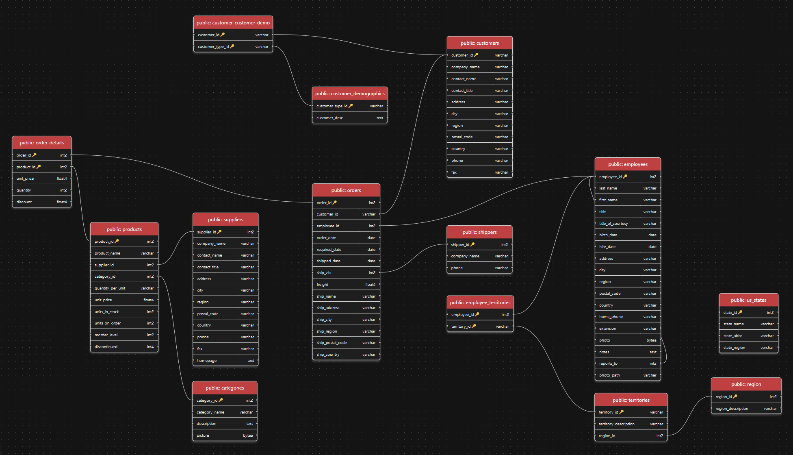

🔗 Este documento também está disponível em [Português](./README.pt-BR.md).

# 📊 Advanced Report in SQL — Northwind Database


## Goal

This repository aims to demonstrate how to generate **advanced analytical reports in SQL**, using the **Northwind** database as a study base.

The queries presented here simulate real-world analyses applicable to companies of all sizes that want to **make data-driven decisions**, measuring sales performance, customer behavior, and marketing opportunities.

---

## Context: Northwind Database

The **Northwind** database contains sales data from the fictitious company **Northwind Traders**, which imports and exports specialty foods worldwide.

It includes information about:  
- **Suppliers:** Business partners and vendors  
- **Customers:** Companies that purchase products from Northwind  
- **Employees:** Sales team  
- **Products:** Catalog and prices  
- **Orders and Order Details:** Sales transactions  
- **Shippers:** Responsible for deliveries  

The dataset has **14 tables** and covers the complete order cycle, from the customer to invoicing, as shown in the following entity-relationship diagram.



---

## How to Execute

### Manually

Use the provided SQL file, `sql/northwind.sql`, to populate your database.

### With Docker (Recommended)

**Prerequisite:** Install Docker Desktop


* [Get Started with Docker](https://www.docker.com/get-started)


### Steps for Docker setup:

1. Launch Docker Desktop

2. **Clone** the repository and enter the project folder via Git Bash:

    ```bash
    git clone https://github.com/arthurdurso/Project-NorthWind-Analysis.git

    cd Project-NorthWind-Analysis
    ```
    
3. Start the services with the **command**: (Wait for it to fully run)
    ```bash
    docker compose up
    ```
    
4. **Connect PgAdmin**  
Access PgAdmin at [http://localhost:5050](http://localhost:5050), using the password `postgres`.  

Add a new server in PgAdmin:  

- **General Tab**:  
  - Name: `db`  
- **Connection Tab**:  
  - Host: `db`  
  - Username: `postgres`  
  - Password: `postgres`  

Then, just **Save**. You will be able to select the **northwind** database under the **db** server.

5. **Explore the Database**  

In PgAdmin, you can check all **tables and views** in the northwind database:  

- Expand server `db` → `Databases` → `northwind` → `Schemas` → `public` to see tables and views.  
- Right-click → **View/Edit Data** → **All Rows** to inspect the contents of each table.  

6. **Stop Docker Compose:**  
Stop the server started with `docker-compose up` using Ctrl-C, and remove containers with:

    
    ```
    docker-compose down
    ```
    
7. **Files and Persistence:**
Your changes in the Postgres databases are persisted in the Docker volume postgresql_data and can be recovered by restarting Docker Compose with docker-compose up.
To delete all database data, run:
    
    ```
    docker-compose down -v
    ```

---

## Reports Created

Below are examples of analytical SQL queries developed from the Northwind database.

Each report aims to answer real business questions — such as sales volume, customer performance, and trends over time.

These queries can serve as the basis for dashboards, performance analyses, or Business Intelligence (BI) studies.

## Business Questions

1. **Revenue Reports**
    
    * What was the total revenue in 1997?

    ```sql
    SELECT ROUND(SUM(od.unit_price * od.quantity * (1 - od.discount))::NUMERIC, 2) AS total_revenue_1997
    FROM order_details od
    JOIN (
        SELECT 
            order_id
        FROM orders 
        WHERE EXTRACT(YEAR FROM order_date) = 1997
    ) AS o 
    on od.order_id = o.order_id;
    ```

    * Analyze monthly growth and calculate YTD revenue

    ```sql
    WITH Monthly_Revenue AS (
        SELECT 
            EXTRACT(YEAR FROM o.order_date) AS order_year,
            EXTRACT(MONTH FROM o.order_date) AS order_month,
            ROUND(SUM(od.unit_price * od.quantity * (1 - od.discount))::NUMERIC, 2) AS total_revenue
        FROM order_details od
        JOIN orders o 
        on od.order_id = o.order_id
        GROUP BY order_year, order_month
        ORDER BY order_year, order_month
    ), Acumulative_Revenue AS (
        SELECT
            order_year,
            order_month,
            total_revenue,
            SUM(total_revenue) OVER (PARTITION BY order_year ORDER BY order_month) AS ytd_revenue
        FROM Monthly_Revenue
    )

    SELECT  
            order_year,
            order_month,
            total_revenue,
            total_revenue - LAG(total_revenue) OVER (PARTITION BY order_year ORDER BY order_month) AS month_growth,
            ytd_revenue,
            ROUND((total_revenue - LAG(total_revenue) OVER (PARTITION BY order_year ORDER BY order_month)) / LAG(total_revenue) OVER (PARTITION BY order_year ORDER BY order_month) * 100::NUMERIC, 2) AS month_growth_percentage
    FROM Acumulative_Revenue;
    ```

2. **Customer Segmentation**
    
    * What is the total amount each customer has paid so far?

    ```sql
        SELECT  
            c.contact_name,
            ROUND(SUM(od.unit_price * od.quantity * (1 - od.discount) + o.freight)::NUMERIC, 2) AS total_paid
    FROM customers c
    JOIN orders o ON c.customer_id = o.customer_id
    JOIN order_details od ON od.order_id = o.order_id
    GROUP BY c.contact_name
    ORDER BY total_paid DESC;
    ```
    
    * Split customers into 5 groups according to total payment

    ```sql
    WITH Customer_Payments AS (
    SELECT  
            c.customer_id,
            c.contact_name,
            ROUND(SUM(od.unit_price * od.quantity * (1 - od.discount) + o.freight)::NUMERIC, 2) AS total_paid
    FROM customers c
    JOIN orders o ON c.customer_id = o.customer_id
    JOIN order_details od ON od.order_id = o.order_id
    GROUP BY c.customer_id, c.contact_name
    ), Ranked_Customers AS (
        SELECT 
            customer_id,
            contact_name,
            total_paid,
            NTILE(5) OVER (ORDER BY total_paid DESC) AS payment_group
        FROM Customer_Payments
    )

    SELECT 
            *
    FROM Ranked_Customers;
    ```
    
    * Select only customers in groups 3, 4, and 5 for special marketing analysis

    ```sql
    -- Using the previous WITH 

    SELECT 
            *
    FROM Ranked_Customers
    WHERE payment_group IN (3, 4, 5);
    ```

3. **Top 10 Best-Selling Products**
    
    * Identify the 10 best-selling products.

    ```sql
    SELECT 
            p.product_name,
            SUM(od.quantity) AS total_quantity_sold
    FROM products p
    JOIN order_details od ON p.product_id = od.product_id
    GROUP BY p.product_name
    ORDER BY total_quantity_sold DESC
    LIMIT 10;
    ```
    
4. **UK Customers Who Paid Over 1000 Dollars**
    
    * Which UK customers paid more than 1000 dollars?

    ```sql
    SELECT 
            c.contact_name,
            ROUND(SUM(od.unit_price * od.quantity * (1 - od.discount) + o.freight)::NUMERIC, 2) AS total_paid
    FROM orders o
    JOIN order_details od ON od.order_id = o.order_id
    JOIN (
        SELECT 
                customer_id,
                contact_name,
                country
        FROM customers
        WHERE UPPER(country) = 'UK'
    ) AS c ON c.customer_id = o.customer_id
    GROUP BY c.contact_name
    HAVING SUM(od.unit_price * od.quantity * (1 - od.discount) + o.freight) > 1000
    ORDER BY total_paid DESC;
    ```
    
---